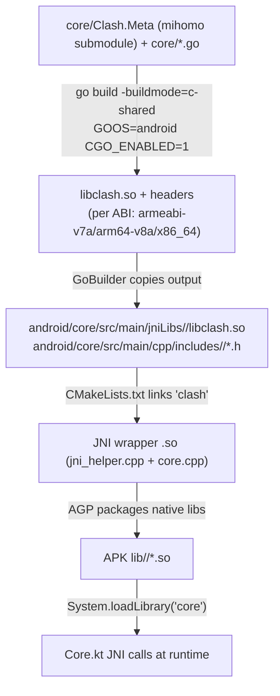
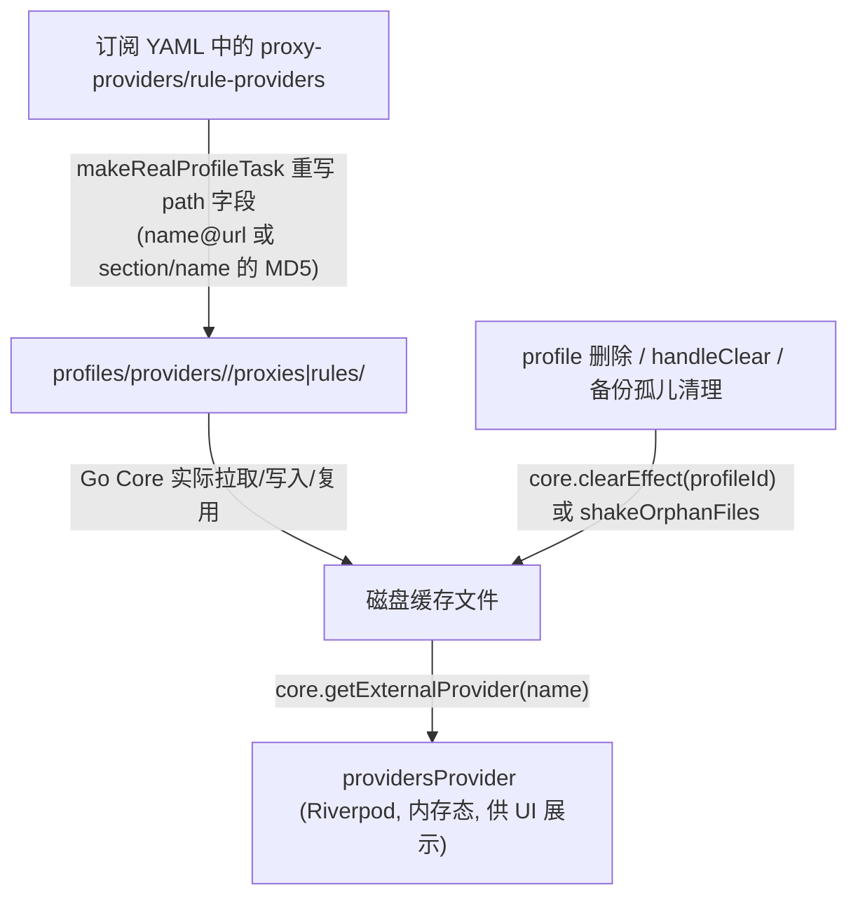
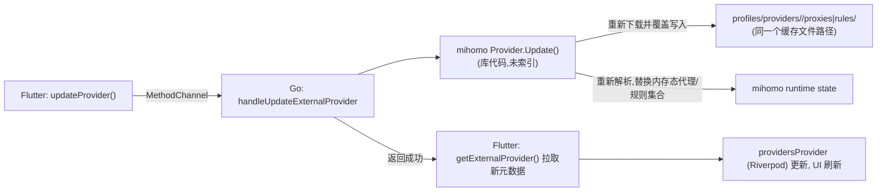

[clash core编译](https://deepwiki.com/search/clash-coreapk_4d679c85-6040-4755-8d46-8baeb243bcb2)


# DeepWiki Q&A with Code Context for Repository: chen08209/FlClash
## Q1
clash core是怎么编译时apk文件中的
### Answer
## Clash core 是如何在编译时打包进 APK 的

整个流程分为三步：**Go 编译成 native 库 → 拷贝进 Android 模块 → Gradle/CMake 把它链接进 APK 的 JNI 层**。

### 1. Go Core 编译为 C 共享库

FlClash 把 ClashMeta (mihomo) 的 Go 源码作为 submodule 放在 `core/Clash.Meta/`,而 `core/` 目录下是 FlClash 自己的 Go 包装代码(如 `core/hub.go`、`core/lib.go`),两者一起以 CGO 方式编译。对于 Android 目标,构建脚本用 `go build -buildmode=c-shared` 生成 `libclash.so` 及对应的 C 头文件: FlClash:7-14 

具体触发逻辑在 `GoBuilder.build()` 中,针对每个 Android ABI(`armeabi-v7a`、`arm64-v8a`、`x86_64`)分别设置 `GOOS=android`、对应的 `GOARCH`、`CGO_ENABLED=1`,并用 Android NDK 提供的 clang 作为 `CC`: FlClash:114-133 

编译命令本身: FlClash:127-133 

### 2. 产物拷贝进 Android `:core` 模块

编译完成后,`libclash.so` 和头文件被复制到 `android/core/src/main/jniLibs/<abi>/` 和 `android/core/src/main/cpp/includes/<abi>/`: FlClash:241-273 

这一步是由 Flutter 构建钩子(`build hook`)在每次 `flutter build`/`flutter test` 时自动触发,由 `plugins/setup/hook/build.dart` 驱动 `setup_hooks` 包中的 `CoreBuilder` 完成: FlClash:20-27 

### 3. CMake/Gradle 把 `libclash.so` 链接进最终的 JNI `.so`

`android/core` 模块通过 CMake 编译自己的 JNI 桥接代码(`jni_helper.cpp`、`core.cpp`),并静态/动态链接刚拷贝进来的 `libclash`: FlClash:16-28 

`android/core/build.gradle.kts` 中配置了 `externalNativeBuild` 指向该 CMakeLists,并设置 ABI 过滤;同时通过 Gradle task 排序保证 Core 的 Go 构建 hook 一定在 CMake/JNI 相关 native task 之前跑完,否则直接报错终止构建,避免打包出过期或缺失的 Core: FlClash:7-34 FlClash:63-87 

最终 Kotlin 侧的 `Core` 对象通过 `System.loadLibrary("core")` 加载这个包含了 ClashMeta 逻辑的 `.so`,并通过 JNI `external fun` 声明与其交互(启动 TUN、获取流量统计等): FlClash:1-17 FlClash:132-134 

这个 `.so` 最终作为标准 Android native library 被 AGP 打包进 APK 的 `lib/<abi>/` 目录中,运行时由 App 进程直接加载(Android 上 Core 是进程内运行,而非像桌面平台一样作为独立进程通过 IPC 通信): FlClash:5-14 

### 整体流程图




**关键点总结:**
- Go core 不是通过 gomobile,而是用标准 `go build -buildmode=c-shared` 生成 C 共享库。
- 整个流程由 Dart 的 `hooks` 机制驱动(`build.dart` hook),在 `flutter build android` 时自动执行,不需要手动运行 Go 命令。
- Gradle 的 `:core` 模块用 CMake 把 Go 产出的 `libclash.so` 链接进自己的 JNI 中间层 `.so`,该层再打进最终 APK。
- Android 上 Core 与应用运行在同一进程内(与桌面平台的独立进程 + IPC 模型不同)。
### Citations
**File:** .agents/architecture.md (L5-14)
```markdown
The Go proxy core in `core/` operates in two modes.

Android lib mode:

- Go core is compiled as a C shared library, `libclash.so`, through `go build -buildmode=c-shared` with CGO.
- The Android `:core` module owns JNI access to the in-process library. Flutter crosses the `${packageName}/service`
  MethodChannel through `lib/plugins/service.dart` and Android's `ServicePlugin` rather than talking to JNI directly.
- `lib/core/lib.dart` (`CoreLib`) implements the shared Core interface, gates method calls on its connection completer,
  initializes and synchronizes Android shared state, and closes the native service path exactly once.
- Because Core is in the application process on Android, application RSS already includes Core memory.
```
**File:** plugins/setup/setup_hooks/lib/src/go_builder.dart (L114-133)
```dart
  Map<String, String> _buildEnvironment(Target target) {
    final env = <String, String>{'GOOS': target.goos, 'GOARCH': target.goarch};
    if (target.isLib) {
      env
        ..['CGO_ENABLED'] = '1'
        ..['CC'] = _resolveCc(target)
        ..['CFLAGS'] = '-O3 -Werror';
    } else {
      env['CGO_ENABLED'] = '0';
    }
    return env;
  }

  List<String> _buildArguments(Target target, {String? outFile}) => [
    'build',
    '-ldflags=${config.goLdflags}',
    '-tags=${config.tags}',
    if (target.isLib) '-buildmode=c-shared',
    if (outFile != null) ...['-o', outFile],
  ];
```
**File:** plugins/setup/setup_hooks/lib/src/go_builder.dart (L241-273)
```dart
    final androidCoreMainPath = p.join(
      rootDir,
      'android',
      'core',
      'src',
      'main',
    );
    final jniLibsPath = p.join(androidCoreMainPath, 'jniLibs', abi);
    final cppIncludesPath = p.join(androidCoreMainPath, 'cpp', 'includes', abi);
    final outputs = <String>[];

    ensureDir(includesPath);
    _clearDirectory(includesPath);
    ensureDir(cppIncludesPath);
    _clearDirectory(cppIncludesPath);

    replaceFile(p.join(stagingDir, libName), outFile);
    copyFile(outFile, p.join(jniLibsPath, libName));
    outputs.add(p.join(jniLibsPath, libName));

    final generatedHeaders = Directory(stagingDir).listSync();
    final staticHeaders = Directory(_corePath).listSync();
    for (final file in [...generatedHeaders, ...staticHeaders]) {
      if (!file.path.endsWith('.h')) continue;
      final headerName = p.basename(file.path);
      final includePath = p.join(includesPath, headerName);
      final cppIncludePath = p.join(cppIncludesPath, headerName);
      copyFile(file.path, includePath);
      copyFile(file.path, cppIncludePath);
      outputs
        ..add(includePath)
        ..add(cppIncludePath);
    }
```
**File:** .agents/commands.md (L20-27)
```markdown
The Go core and the Rust helper build automatically: Flutter runs
`plugins/setup/hook/build.dart` on every `flutter build` and `flutter test`,
and the hook drives `CoreBuilder` from the `setup_hooks` package in
`plugins/setup/setup_hooks/`. Android builds take the NDK from the C compiler
Flutter hands the hook; no `ANDROID_NDK` variable is needed.
Artifacts land in `libclash/`. The hook reruns only when Go, Rust, or
`setup_hooks` inputs change; the fingerprint cache lives in
`.dart_tool/setup_build_cache/`. To force a rebuild, delete that directory:
```
**File:** android/core/src/main/cpp/CMakeLists.txt (L16-28)
```text
set(LIB_CLASH_INCLUDE_DIR "${CMAKE_SOURCE_DIR}/../cpp/includes/${ANDROID_ABI}")

# Never make linking libclash conditional on the file existing: AGP's configure
# fingerprint tracks only CMakeLists.txt, so a configure that ran before the build
# hook would stay cached and silently drop the Core. Failing at compile or link
# time is what keeps that decision out of the configure step.
include_directories(${LIB_CLASH_INCLUDE_DIR})
link_directories(${CMAKE_SOURCE_DIR}/../jniLibs/${ANDROID_ABI})
add_library(${CMAKE_PROJECT_NAME} SHARED
        jni_helper.cpp
        core.cpp)
target_link_libraries(${CMAKE_PROJECT_NAME}
        clash)
```
**File:** android/core/build.gradle.kts (L7-34)
```text
// Must equal Target.forPlatform("android") in setup_hooks, which writes libclash.so only for the platforms being built.
val coreAbiByPlatform =
    linkedMapOf("android-arm" to "armeabi-v7a", "android-arm64" to "arm64-v8a", "android-x64" to "x86_64")
val coreAbis =
    (rootProject.findProperty("target-platform") as String?)
        ?.split(",")
        ?.map { coreAbiByPlatform[it.trim()] ?: throw GradleException("No Core for Flutter target platform $it") }
        ?: coreAbiByPlatform.values.toList()

android {
    namespace = "com.follow.clash.core"
    compileSdk = libs.versions.compileSdk.get().toInt()
    ndkVersion = libs.versions.ndkVersion.get()

    defaultConfig {
        minSdk = libs.versions.minSdk.get().toInt()

        ndk {
            abiFilters += coreAbis
        }
    }

    externalNativeBuild {
        cmake {
            path("src/main/cpp/CMakeLists.txt")
            version = "3.22.1"
        }
    }
```
**File:** android/core/build.gradle.kts (L63-87)
```text
gradle.taskGraph.whenReady {
    val nativeTask =
        allTasks.firstOrNull {
            it.path.startsWith("${project.path}:") && nativeTaskPattern.containsMatchIn(it.name)
        }
    if (nativeTask == null || allTasks.any { it.path.startsWith(":app:compileFlutterBuild") }) {
        return@whenReady
    }
    val missing =
        coreAbis
            .flatMap {
                listOf(file("src/main/jniLibs/$it/libclash.so"), file("src/main/cpp/includes/$it/libclash.h"))
            }.filterNot { it.isFile }
    if (missing.isNotEmpty()) {
        throw GradleException(
            "${nativeTask.name} consumes Core artifacts that the setup build hook writes into src/main, " +
                "and these are absent: ${missing.joinToString { it.relativeTo(projectDir).path }}. " +
                "Run `dart setup.dart android` once, or build through :app so the hook runs first.",
        )
    }
    logger.warn(
        ":core: ${nativeTask.name} is running without an :app Flutter compile task, " +
            "so the Core artifacts under src/main are whatever the last hook run left behind",
    )
}
```
**File:** android/core/src/main/java/com/follow/clash/core/Core.kt (L1-17)
```kotlin
package com.follow.clash.core

import java.net.InetAddress
import java.net.InetSocketAddress
import java.net.URI

object Core {
    private external fun startTun(
        fd: Int,
        cb: TunInterface,
        stack: String,
        address: String,
        dns: String,
    ): Boolean

    external fun forceGC()

```
**File:** android/core/src/main/java/com/follow/clash/core/Core.kt (L132-134)
```kotlin
    init {
        System.loadLibrary("core")
    }
```
## Q2
provider是怎么存储的
### Answer
## Provider(代理/规则外部数据源)的存储机制

"Provider" 这里指 Clash 配置中的 `proxy-providers`/`rule-providers`(即 Clash Meta 定期从远程 URL 拉取的代理/规则集合),FlClash 对它的存储分两层:**磁盘上的缓存文件**和**内存中的 Riverpod 状态**。

### 1. 磁盘存储路径

每个 profile(订阅配置)有自己独立的 provider 目录,路径由 `AppPath` 构造: FlClash:132-153 

即目录结构为 `<home>/profiles/providers/<profileId>/proxies/` 和 `<home>/profiles/providers/<profileId>/rules/`,`ensureProviderDirs` 会在生成 profile 时确保这两个目录存在。

### 2. Provider 在配置文件中的具体路径

在把订阅原始 YAML 转换为最终喂给 Go Core 的配置时(`makeRealProfileTask`),FlClash 会给每个 `proxy-providers`/`rule-providers` 条目注入一个 `path` 字段,指向本地磁盘上的缓存文件位置。文件名是 `"<provider名>@<url>"` 或 `"<section>/<name>"` 的 MD5 值,用来避免路径穿越攻击(比如订阅里写 `../../../etc/hosts` 之类的恶意路径),也避免不同 provider 之间的文件名冲突: FlClash:41-84 FlClash:86-137 

这个逻辑在 `lib/common/task.dart` 的 provider 路径处理函数中实现(涉及 `proxiesProviderDirectoryName`/`rulesProviderDirectoryName`),对 `type: file` 且带有用户自定义 `path` 的 provider 也会重写成受控路径,防止使用用户输入的路径直接读写任意文件。

Go Core(mihomo)拿到这个 `path` 之后,自己负责实际的 HTTP 拉取、写入该文件、以及后续的按需重新加载 —— FlClash 侧不管文件内容格式,只负责"分配一个安全的本地缓存路径"。

### 3. 清理机制

当一个 profile 被删除,或者应用被重置(`StoreAction.handleClear`)时,对应的 provider 目录会被清空。Go 侧提供了 `handleClearEffect`,依据 `profileId` 拼出 provider 目录路径并整体删除,这个函数刻意限制成"只能删除某个 profile 对应的目录",防止被滥用为任意文件删除接口: FlClash:646-669 

Dart 侧的 `StoreAction.handleClear` 会遍历数据库中记录的 profile,以及磁盘上"孤儿" provider 目录(数据库里已经不存在但磁盘上仍有残留的 profileId),逐一调用 `core.clearEffect`: FlClash:109-124 

另外,`backup_task.dart`(备份/恢复功能)里也有 `shakeOrphanFiles` 逻辑,用来识别 `providers/<id>/proxies/*` 中不再属于任何存活 profile 的孤儿数据: FlClash:63-88 

### 4. 内存中的运行态(应用侧展示用)

除了磁盘缓存,FlClash 在 Flutter 侧还维护了一个 Riverpod 状态 `providersProvider`(`List<ExternalProvider>`),用于 UI 展示 provider 列表、更新时间、更新中状态等。它不是持久化存储,而是每次连接 Core 后通过 `_core.getExternalProvider(name)` 从 Core 拉取最新元数据后 `setProvider` 写回状态: FlClash:177-231 

`providersProvider` 的状态被其它页面(如"是否有 providers 显示更新按钮")通过 `select` 监听: FlClash:54-68 

### 小结



**未完全确认的部分**:`lib/common/task.dart` 中把 provider `path` 字段替换为 MD5 哈希路径的具体函数实现代码没有直接读取到(只看到了单测覆盖的行为),如果需要精确到函数签名和逐行逻辑,建议进一步查看该文件的完整源码。
### Citations
**File:** lib/common/path.dart (L132-153)
```dart
  Future<String> getProvidersRootPath() async {
    final directory = await profilesPath;
    return join(directory, providersDirectoryName);
  }

  Future<String> getProviderDirPath(int profileId, String type) async {
    final directory = await getProvidersRootPath();
    return join(directory, profileId.toString(), type);
  }

  Future<void> ensureProviderDirs(int profileId) async {
    for (final type in const [
      proxiesProviderDirectoryName,
      rulesProviderDirectoryName,
    ]) {
      final directory = Directory(await getProviderDirPath(profileId, type));
      if (await directory.exists()) {
        continue;
      }
      await directory.create(recursive: true);
    }
  }
```
**File:** test/common/path_test.dart (L41-84)
```dart
  test('provider directories match the paths handed to the core', () async {
    const proxiesUrl = 'https://example.com/a.yaml';
    const rulesUrl = 'https://example.com/b.yaml';
    final proxiesDir = await appPath.getProviderDirPath(
      7,
      proxiesProviderDirectoryName,
    );
    final rulesDir = await appPath.getProviderDirPath(
      7,
      rulesProviderDirectoryName,
    );

    final result = await makeRealProfileTask(
      MakeRealProfileState(
        profilesPath: await appPath.profilesPath,
        profileId: 7,
        rawConfig: {
          'proxy-providers': {
            'a': {'type': 'http', 'url': proxiesUrl},
          },
          'rule-providers': {
            'b': {'type': 'http', 'url': rulesUrl},
          },
        },
        realPatchConfig: const PatchClashConfig(),
        overrideDns: false,
        appendSystemDns: false,
        proxyGroups: const [],
        rules: const [],
        addedRules: const [],
        defaultUA: 'FlClash',
      ),
    );
    final config = loadYaml(result.yaml) as YamlMap;

    expect(
      config['proxy-providers']['a']['path'],
      join(proxiesDir, 'a@$proxiesUrl'.toMd5()),
    );
    expect(
      config['rule-providers']['b']['path'],
      join(rulesDir, 'b@$rulesUrl'.toMd5()),
    );
  });
```
**File:** test/common/path_test.dart (L86-137)
```dart
  test('confines a provider path the profile tried to choose', () async {
    final proxiesDir = await appPath.getProviderDirPath(
      7,
      proxiesProviderDirectoryName,
    );
    final rulesDir = await appPath.getProviderDirPath(
      7,
      rulesProviderDirectoryName,
    );

    final result = await makeRealProfileTask(
      MakeRealProfileState(
        profilesPath: await appPath.profilesPath,
        profileId: 7,
        rawConfig: {
          'proxy-providers': {
            'escape': {'type': 'file', 'path': '../../../../config.yaml'},
            'urlless': {'type': 'http', 'path': 'cache.db'},
            'literal': {
              'type': 'inline',
              'payload': ['DIRECT'],
            },
          },
          'rule-providers': {
            'sneak': {'type': 'file', 'path': '/etc/hosts'},
          },
        },
        realPatchConfig: const PatchClashConfig(),
        overrideDns: false,
        appendSystemDns: false,
        proxyGroups: const [],
        rules: const [],
        addedRules: const [],
        defaultUA: 'FlClash',
      ),
    );
    final config = loadYaml(result.yaml) as YamlMap;

    expect(
      config['proxy-providers']['escape']['path'],
      join(proxiesDir, 'proxy-providers/escape'.toMd5()),
    );
    expect(
      config['proxy-providers']['urlless']['path'],
      join(proxiesDir, 'proxy-providers/urlless'.toMd5()),
    );
    expect(config['proxy-providers']['literal']['path'], isNull);
    expect(
      config['rule-providers']['sneak']['path'],
      join(rulesDir, 'rule-providers/sneak'.toMd5()),
    );
  });
```
**File:** core/hub.go (L646-669)
```go
// The profile ID is an int64 rendered through strconv, so the last element can
// never carry a separator or a `..` — that is what keeps handleClearEffect from
// becoming a general-purpose privileged file deletion API.
func providerPaths(homeDir string, profileId int64) (root string, target string) {
	root = filepath.Join(homeDir, "profiles", "providers")
	return root, filepath.Join(root, strconv.FormatInt(profileId, 10))
}

// handleClearEffect derives the provider directory from a profile ID so the
// method cannot be used as a general-purpose privileged file deletion API.
func handleClearEffect(profileId int64) string {
	if !isInit.Load() {
		return "not initialized"
	}
	if profileId <= 0 {
		return "invalid profile id"
	}
	providersRoot, providersPath := providerPaths(constant.Path.HomeDir(), profileId)
	if err := os.RemoveAll(providersPath); err != nil {
		return err.Error()
	}
	_ = os.Remove(providersRoot)
	return ""
}
```
**File:** test/providers/store_action_test.dart (L109-124)
```dart
    test('also clears profiles that only survive on disk', () async {
      await providerDirFor(41);
      await providerDirFor(42);
      final container = buildContainer(profiles: [profile(1)]);

      await container.read(storeActionProvider.notifier).handleClear();

      final cleared = verify(() => core.clearEffect(captureAny())).captured;
      expect(
        cleared.toSet(),
        {1, 41, 42},
        reason:
            'a provider directory left behind by a profile the database no '
            'longer knows about still holds downloaded rule data.',
      );
    });
```
**File:** test/common/backup_task_test.dart (L63-88)
```dart
  group('shakeOrphanFiles', () {
    test('reports only the files whose name is not a live id', () {
      final profiles = makeDir('profiles');
      final scripts = makeDir('scripts');
      final providers = makeDir('providers');
      writeFile(join(profiles.path, '1.yaml'), 'keep');
      writeFile(join(profiles.path, '2.yaml'), 'drop');
      writeFile(join(scripts.path, '10.js'), 'keep');
      writeFile(join(scripts.path, '20.js'), 'drop');
      writeFile(join(providers.path, '1', 'proxies', 'abc'), 'keep');
      writeFile(join(providers.path, '2', 'proxies', 'abc'), 'drop');

      final orphans = shakeOrphanFiles(
        profileIds: [1],
        scriptIds: [10],
        profilesDirPath: profiles.path,
        providersDirPath: providers.path,
        scriptsDirPath: scripts.path,
      );

      expect(orphans.map(basename), unorderedEquals(['2.yaml', '20.js', '2']));
      expect(
        orphans.singleWhere((path) => basename(path) == '2'),
        join(providers.path, '2'),
      );
    });
```
**File:** lib/providers/actions/proxies.dart (L177-231)
```dart
  Future<String> updateProvider(
    ExternalProvider provider, {
    bool showLoading = false,
  }) async {
    final operation = showLoading
        ? ref
              .read(updatingKeysProvider.notifier)
              .start(provider.updatingKey, scope: UpdatingScope.core)
        : null;
    try {
      final message = await _core.updateExternalProvider(
        providerName: provider.name,
      );
      if (message.isNotEmpty) return message;
      ref
          .read(providersProvider.notifier)
          .setProvider(await _core.getExternalProvider(provider.name));
      return '';
    } finally {
      if (operation != null) {
        ref
            .read(updatingKeysProvider.notifier)
            .stop(provider.updatingKey, operation);
      }
    }
  }

  Future<String> sideLoadExternalProvider(
    ExternalProvider provider,
    String data, {
    bool showLoading = false,
  }) async {
    final operation = showLoading
        ? ref
              .read(updatingKeysProvider.notifier)
              .start(provider.updatingKey, scope: UpdatingScope.core)
        : null;
    try {
      final message = await _core.sideLoadExternalProvider(
        providerName: provider.name,
        data: data,
      );
      if (message.isNotEmpty) return message;
      ref
          .read(providersProvider.notifier)
          .setProvider(await _core.getExternalProvider(provider.name));
      return '';
    } finally {
      if (operation != null) {
        ref
            .read(updatingKeysProvider.notifier)
            .stop(provider.updatingKey, operation);
      }
    }
  }
```
**File:** lib/providers/state/proxies.dart (L54-68)
```dart
@riverpod
ProxiesActionsState proxiesActionsState(Ref ref) {
  final pageLabel = ref.watch(currentPageLabelProvider);
  final hasProviders = ref.watch(
    providersProvider.select((state) => state.isNotEmpty),
  );
  final type = ref.watch(
    proxiesStyleSettingProvider.select((state) => state.type),
  );
  return ProxiesActionsState(
    pageLabel: pageLabel,
    hasProviders: hasProviders,
    type: type,
  );
}
```
## Q3
那么当go core更新providers后，还会重新更新缓存吗
### Answer
## Go Core 更新 Provider 后,会重新写入缓存文件

会。Provider 的更新调用链最终落到 mihomo(ClashMeta)库自身的 `Provider.Update()` 方法,该方法会重新拉取远程内容并**覆盖写入同一个缓存路径**(即之前 `makeRealProfileTask` 注入到 `path` 字段的那个 MD5 路径文件),而不是每次生成新文件或只保存在内存里。

### 触发路径

Flutter 侧调用 `updateProvider` 时,会经 `MethodChannel` 调到 Go Core 的 `updateExternalProvider(providerName)`: FlClash:177-202 

Go 侧对应的处理函数 `handleUpdateExternalProvider` 先通过 `lookupExternalProvider` 找到 mihomo 的 provider 对象 `p`,做并发保护(`claimUpdate`/`releaseUpdate` 防止同一个 provider 被并发更新两次),然后直接调用 `p.Update()`: FlClash:469-495 

`p` 的类型来自 mihomo 库的 `github.com/metacubex/mihomo/constant/provider`(`cp`)和 `github.com/metacubex/mihomo/adapter/provider`,在 `core/common.go` 中被引入: FlClash:1-38 

### `p.Update()` 做了什么(基于 mihomo 库行为,不在本仓库索引范围内)

`Update()` 是 mihomo 库(`github.com/metacubex/mihomo`,作为 Go module 依赖,其源码不在 FlClash 仓库索引中,因此无法直接引用具体行号)提供的方法,其标准行为是:
1. 通过 provider 的 Vehicle(HTTP/File)重新拉取最新内容;
2. 校验内容后,把新内容写回 provider 初始化时记录的本地缓存路径 —— 也就是 FlClash 在生成配置时通过 `makeRealProfileTask` 写入 `proxy-providers`/`rule-providers` 的 `path` 字段所指向的那个文件(`profiles/providers/<profileId>/proxies|rules/<md5>`);
3. 重新解析新内容,替换内存中的代理/规则集合,供后续流量匹配使用。

也就是说,缓存文件路径在 provider 首次创建时就已经固定(由 FlClash 分配,防止路径穿越),之后每次 `Update()` 都是对**同一个文件**做覆盖写入,不会产生新文件或残留旧版本。

### Flutter 侧的后续同步

Go Core 更新完成、返回空字符串(表示成功)后,Flutter 侧会立刻调用 `_core.getExternalProvider(name)` 拉取最新元数据(条目数、更新时间等),写回 Riverpod 状态 `providersProvider`,驱动 UI 刷新: FlClash:186-194 

这一行为在测试中也有覆盖,验证更新成功后 `providersProvider` 状态确实被替换为刷新后的数据: FlClash:508-536 

### 小结



**不确定/未验证的部分**:mihomo 库中 `Provider.Update()` 的具体实现(是否有写入前的原子替换、是否保留旧文件备份等细节)不在 FlClash 仓库的索引范围内,因为它属于 `github.com/metacubex/mihomo` 这个外部 Go 依赖。如果需要精确到该方法的逐行实现,需要直接查看 vendor/go mod cache 中的 mihomo 源码,建议通过 Devin session 拉取该依赖源码确认。
### Citations
**File:** lib/providers/actions/proxies.dart (L177-202)
```dart
  Future<String> updateProvider(
    ExternalProvider provider, {
    bool showLoading = false,
  }) async {
    final operation = showLoading
        ? ref
              .read(updatingKeysProvider.notifier)
              .start(provider.updatingKey, scope: UpdatingScope.core)
        : null;
    try {
      final message = await _core.updateExternalProvider(
        providerName: provider.name,
      );
      if (message.isNotEmpty) return message;
      ref
          .read(providersProvider.notifier)
          .setProvider(await _core.getExternalProvider(provider.name));
      return '';
    } finally {
      if (operation != null) {
        ref
            .read(updatingKeysProvider.notifier)
            .stop(provider.updatingKey, operation);
      }
    }
  }
```
**File:** core/hub.go (L469-495)
```go
func handleUpdateExternalProvider(providerName string) *MethodError {
	p, exist := lookupExternalProvider(providerName)
	if !exist {
		return providerMethodError(
			"provider_not_found",
			providerName,
			errors.New("external provider does not exist"),
		)
	}
	key := providerUpdateScope + providerName
	if !claimUpdate(key) {
		return providerMethodError(
			"provider_updating",
			providerName,
			errors.New("external provider is updating"),
		)
	}
	defer releaseUpdate(key)
	if err := p.Update(); err != nil {
		code := providerRequestErrorCode(err)
		if code == "" {
			code = "provider_update_error"
		}
		return providerMethodError(code, providerName, err)
	}
	return nil
}
```
**File:** core/common.go (L1-38)
```go
package main

import (
	b "bytes"
	"context"
	"encoding/json"
	"errors"
	"fmt"
	"os"
	"path/filepath"
	"runtime"
	"strings"
	"sync"
	"sync/atomic"
	"time"

	"github.com/metacubex/mihomo/adapter"
	"github.com/metacubex/mihomo/adapter/inbound"
	"github.com/metacubex/mihomo/adapter/outboundgroup"
	"github.com/metacubex/mihomo/adapter/provider"
	"github.com/metacubex/mihomo/component/auth"
	"github.com/metacubex/mihomo/component/dialer"
	"github.com/metacubex/mihomo/component/resolver"
	"github.com/metacubex/mihomo/component/updater"
	"github.com/metacubex/mihomo/config"
	"github.com/metacubex/mihomo/constant"
	"github.com/metacubex/mihomo/constant/features"
	cp "github.com/metacubex/mihomo/constant/provider"
	"github.com/metacubex/mihomo/hub"
	"github.com/metacubex/mihomo/hub/executor"
	"github.com/metacubex/mihomo/hub/route"
	"github.com/metacubex/mihomo/listener"
	authStore "github.com/metacubex/mihomo/listener/auth"
	LC "github.com/metacubex/mihomo/listener/config"
	"github.com/metacubex/mihomo/log"
	rp "github.com/metacubex/mihomo/rules/provider"
	"github.com/metacubex/mihomo/tunnel"
)
```
**File:** test/providers/proxies_action_test.dart (L508-536)
```dart
  group('updateProvider', () {
    test(
      'stores the refreshed provider and clears the updating flag',
      () async {
        final refreshed = _provider('geo', count: 5);
        final release = Completer<String>();
        when(
          () => core.updateExternalProvider('geo'),
        ).thenAnswer((_) => release.future);
        when(
          () => core.getExternalProvider('geo'),
        ).thenAnswer((_) async => refreshed);
        final container = buildContainer();
        container.read(providersProvider.notifier).value = [_provider('geo')];

        final update = actionOf(
          container,
        ).updateProvider(_provider('geo'), showLoading: true);

        expect(container.read(isUpdatingProvider('provider_geo')), isTrue);

        release.complete('');
        final message = await update;

        expect(message, isEmpty);
        expect(container.read(providersProvider), [refreshed]);
        expect(container.read(isUpdatingProvider('provider_geo')), isFalse);
      },
    );
```
## Q4
怎么修改编译android时只编译armv8
### Answer
## 只编译 armv8(arm64-v8a)的方法

FlClash 的 Android 构建通过 `target-platform` 这个 Gradle 属性来控制实际编译哪些 ABI,这个属性又通过 `--build-target-platform` 传给 Flutter,最终驱动两处过滤:Go Core 的编译目标(`setup_hooks` 里的 `Target`)和 `:core` 模块的 `ndk.abiFilters`。有两种改法,取决于你走的是哪条构建路径。

### 方法一:通过官方的 `setup.dart` 脚本(推荐)

直接用内置的 `--arch` 参数,只构建 arm64:

```bash
dart setup.dart android --arch arm64
```

`setup.dart` 里 `--arch` 只接受 `arm`/`arm64`/`amd64`,并通过 `_androidFlutterTarget` 映射成 Flutter 的 `--build-target-platform=android-arm64`,再传给 `flutter_distributor`: FlClash:15-19 FlClash:94-104 FlClash:198-215 

这个 `--build-target-platform` 最终会设置 Gradle 侧的 `target-platform` 属性,`android/core/build.gradle.kts` 据此过滤 ABI: FlClash:7-27 

同时,`plugins/setup/setup_hooks` 中的 `Target.forPlatform('android')`/`CoreBuilder` 在编译 Go Core 时,只会依据 Flutter 传入的 `Architecture`(即当前 build 对应的架构)构建对应的 `libclash.so`,不会重复编译所有三个 ABI: FlClash:10-24 

架构.md 里也明确写了这两张表必须保持一致(改一个记得同步改另一个): FlClash:570-573 

### 方法二:直接用 `flutter build apk`(不经过 `setup.dart`)

如果你不走 `setup.dart`,而是想直接调 Flutter 命令,可以用标准的 Flutter 参数:

```bash
flutter build apk --target-platform android-arm64
```

原理相同:Flutter 会把 `target-platform=android-arm64` 传给 Gradle,`android/core/build.gradle.kts` 的 `coreAbiByPlatform` 映射表把它转成 `arm64-v8a`,只给这个 ABI 设置 `abiFilters`,同一时刻构建 hook(`plugins/setup/hook/build.dart` → `CoreBuilder`)每个目标架构只跑一次,自然也只为 `arm64-v8a` 生成 `libclash.so`。

### 补充说明

- 不要只改 `android/core/build.gradle.kts` 里的 `coreAbiByPlatform` 映射(比如把它硬编码成只含 arm64-v8a),因为它是从 `target-platform` 属性**过滤**已有条目,而不是决定编译目标本身;真正决定"只编译哪个架构"的是 Flutter/Gradle 传入的 `target-platform` 值,该值又驱动 Go build hook 里 `Target` 的选择。
- 如果只是想本地开发调试(不打正式 APK),`flutter run` / `flutter build apk --debug --target-platform android-arm64` 同样只会触发 arm64 的 Core 编译,速度更快。
- CI workflow(`.github/workflows/build.yaml`)目前是为多架构分发设计的,若要长期只产出 armv8 包,还需要同步简化该 workflow 里对应的矩阵/步骤,但这属于发布流程调整,不是编译本身的必需项。 FlClash:461-466
### Citations
**File:** setup.dart (L15-19)
```dart
const _androidFlutterTarget = {
  'arm': 'android-arm',
  'arm64': 'android-arm64',
  'amd64': 'android-x64',
};
```
**File:** setup.dart (L94-104)
```dart
    ..addOption(
      'targets',
      valueHelp: 'exe,zip,dmg,apk,...',
      help: 'Package targets (default: all for platform)',
    )
    ..addOption(
      'arch',
      valueHelp: 'arm,arm64,amd64',
      allowed: ['arm', 'arm64', 'amd64'],
      help: 'Target architecture (Android only)',
    )
```
**File:** setup.dart (L198-215)
```dart
  final process = await Process.start(
    'flutter_distributor',
    [
      'package',
      '--skip-clean',
      '--platform',
      platform,
      '--targets',
      targets,
      if (androidArch != null)
        '--build-target-platform=${_androidFlutterTarget[androidArch]!}',
      if (flutterBuildArgs.isNotEmpty)
        '--flutter-build-args=${flutterBuildArgs.join(',')}',
      ...descriptionArgs,
    ],
    includeParentEnvironment: true,
    runInShell: Platform.isWindows,
  );
```
**File:** android/core/build.gradle.kts (L7-27)
```text
// Must equal Target.forPlatform("android") in setup_hooks, which writes libclash.so only for the platforms being built.
val coreAbiByPlatform =
    linkedMapOf("android-arm" to "armeabi-v7a", "android-arm64" to "arm64-v8a", "android-x64" to "x86_64")
val coreAbis =
    (rootProject.findProperty("target-platform") as String?)
        ?.split(",")
        ?.map { coreAbiByPlatform[it.trim()] ?: throw GradleException("No Core for Flutter target platform $it") }
        ?: coreAbiByPlatform.values.toList()

android {
    namespace = "com.follow.clash.core"
    compileSdk = libs.versions.compileSdk.get().toInt()
    ndkVersion = libs.versions.ndkVersion.get()

    defaultConfig {
        minSdk = libs.versions.minSdk.get().toInt()

        ndk {
            abiFilters += coreAbis
        }
    }
```
**File:** plugins/setup/setup_hooks/lib/src/target.dart (L10-24)
```dart
  static const androidArm = Target(
    goos: 'android',
    goarch: 'arm',
    abi: 'armeabi-v7a',
  );
  static const androidArm64 = Target(
    goos: 'android',
    goarch: 'arm64',
    abi: 'arm64-v8a',
  );
  static const androidAmd64 = Target(
    goos: 'android',
    goarch: 'amd64',
    abi: 'x86_64',
  );
```
**File:** .agents/architecture.md (L570-573)
```markdown
- `defaultConfig.ndk.abiFilters` is derived from the `target-platform` property Flutter passes to Gradle, mapped
  through the same ABI table as `Target.forPlatform('android')` in `setup_hooks`; keep the two tables equal. The hook
  builds a Core only for the platforms of the current build, so a `:core` ABI outside that set has no `libclash.so` to
  link, and without any filter AGP would configure the NDK's full default ABI set.
```
**File:** .github/workflows/build.yaml (L461-466)
```yaml
      - name: Create Fdroid Source Dir
        if: ${{ env.IS_STABLE == 'true' }}
        run: |
          mkdir -p ./tmp
          cp ./dist/*android-arm64-v8a* ./tmp/ || true
          echo "Files copied successfully"
```
## Q5
当clash config配置中有类似short-id: 08时，传递给clash core(go)的8, go会报错，可能原因是什么
### Answer
这是一个典型的 **YAML 标量类型自动推断(implicit typing)导致的“数字被去掉前导零”问题**,和 FlClash/mihomo 本身的业务逻辑关系不大,根子在 YAML 解析器如何处理不加引号的数字型字符串。

## 根本原因:未加引号的 `08` 被 YAML 解析器当成整数

`short-id` 在 REALITY (VLESS/Trojan-Reality) 配置里要求是一个**偶数位十六进制字符串**(0、2、4、6、8、10、12、14 或 16 个 hex 字符,对应 0~8 字节)。

如果配置里写的是:

```yaml
short-id: 08
```

没有加引号,大多数 YAML 解析器(无论是 Dart 侧用来读取订阅/profile 的 `package:yaml`,还是 Go 侧 mihomo 用的 `gopkg.in/yaml.v3`)都会按照 **plain scalar 隐式类型解析规则**,把这个看起来像数字的裸标量识别成整数字面量 `8`,而不是字符串 `"08"`——前导的 `0` 在十进制整数解析里被当成无意义的前导零直接丢弃。

之后当这个 YAML 节点被反序列化进 Go 结构体的 `string` 字段(mihomo 的 REALITY option 里 `short-id`/`ShortID` 通常声明为 `string` 或 `[]string`)时,`yaml.v3` 允许把 `!!int` 标量节点解成字符串,但用的是该整数的**十进制字符串表示**,也就是 `"8"`,而不是原始文本 `"08"`。于是 Go core 实际拿到的值就从两位 hex 字符 `08` 变成了一位 `8`。

## 为什么这会报错

REALITY 的 short-id 校验/解码逻辑要求是合法的偶数长度十六进制串,通常直接用 `encoding/hex.DecodeString(shortID)` 之类的方式处理。单个字符 `"8"` 是**奇数长度**的十六进制字符串,`hex.DecodeString` 会直接报错(典型错误是 `encoding/hex: odd length hex string`),或者 mihomo 自己的校验逻辑会报 "invalid short-id" / 长度不合法之类的错误。这正是用户观察到的现象——"传过去的是 8,然后报错"。

## FlClash 自身的路径上是否也会触发同样问题

FlClash 在生成"真实 profile"喂给 Go core 之前,自己也会经过一次 YAML 解析→Map→重新序列化的过程:

- 读取订阅/本地文件时用的是标准 Dart `package:yaml`(`loadYaml`),同样遵循 YAML 隐式类型规则,`08` 在这一步就可能已经被解析成 Dart 的 `int` 类型,而不是 `String`。
- 之后 FlClash 用自己 fork 的 `yaml_writer` 包把最终配置 Map 重新序列化成 YAML 字符串,再交给 core: FlClash:1-16 FlClash:61-67 

也就是说,如果 Map 里这个字段已经是 Dart 的整数 `8`(而不是字符串),`YamlWriter().convert()` 序列化时自然只会写出裸的 `8`,前导零早在 Dart 侧被吃掉了,Go core 收到的最终 YAML 文本本身就是 `short-id: 8`。所以问题很可能在 Flutter 侧就已经发生,Go core 只是把已经"损坏"的值再次确认/报错而已。

## 解决办法

在原始配置(无论是订阅内容还是本地编辑的 YAML)里,给这类看起来像数字但实际要保持字符串语义的字段显式加引号:

```yaml
short-id: "08"
```

加了引号之后,YAML 解析器(Dart 侧和 Go 侧)都会把它当作字符串标量处理,不会触发隐式整数转换,前导零和原始文本会被完整保留,传到 Go core 后 `hex.DecodeString("08")` 才能正常解码为 1 个字节。

同理,任何 `short-id`(以及类似的 `uuid`、`password` 里的纯数字段、`alter-id` 之外的十六进制 ID 等)只要**存在前导零或纯数字形式**,都建议在 YAML 里显式加引号,避免被解析器悄悄类型转换。

**说明**:`short-id` 本身是 mihomo(ClashMeta)REALITY 协议的配置项,其具体 hex 解码/校验代码位于 `github.com/metacubex/mihomo` 依赖库中,不在 FlClash 仓库索引范围内,所以上面关于 Go 侧具体报错信息的描述基于 REALITY/hex 解码的通用实现模式推断,如果需要确认 mihomo 里报错的确切代码位置和错误文案,需要直接查看该依赖库源码。
### Citations
**File:** lib/common/yaml.dart (L1-16)
```dart
import 'package:yaml_writer/yaml_writer.dart';

class Yaml {
  static Yaml? _instance;

  Yaml._internal();

  factory Yaml() {
    _instance ??= Yaml._internal();
    return _instance!;
  }

  String encode(Object? value) {
    return YamlWriter().convert(value);
  }
}
```
**File:** .agents/project.md (L61-67)
```markdown
`yaml_writer` — `chen08209/yaml_writer`, version 2.1.0.

- Adds `StringNode.quoteKey()` and applies it to map keys in `lib/src/node.dart`.
  Upstream quotes values but emits keys verbatim, so a profile key needing quotes
  is written as invalid YAML.
- Drop the fork once upstream quotes map keys by the same
  `isValidUnquotedString` rule it already applies to values.
```
## Q6
怎么在go core侧确认接收到是8还是08
### Answer
在 Go core 侧确认到底收到的是 `8` 还是 `08`,有几个层次的排查方法,从最直接到最深入:

## 1. 直接看落盘的 `config.yaml`(最快、最可靠)

FlClash 在把最终配置交给 Go core **之前**,是先把 Dart 侧拼好的 YAML 字符串写到磁盘文件,再让 Go 去读这个文件,不是通过内存/IPC 直接传字符串: FlClash:493-502 

Go 侧 `loadConfig` 就是简单地 `os.ReadFile` 这个路径,再交给 mihomo 的 `executor.ParseWithBytes` 解析: FlClash:368-374 

也就是说,**这个文件里的字节内容,就是 Go 侵 YAML 解析器实际吃到的原始文本**,和 Go 代码本身完全无关。所以最直接的验证方法是:

- Android:通过 `adb shell` 进 App 的私有目录(通常是 `/data/data/<package>/...`,具体路径由 `AppPath` 的 `dataDir`/`configFilePath` 决定),`cat` 这个 `config.yaml` 文件,看 `short-id:` 那一行到底写的是 `08` 还是 `8`、有没有引号。
- 桌面平台:直接用文件管理器/终端打开对应路径下的 `config.yaml`。

如果这个文件里已经是裸的 `8`(没有引号),说明问题**在 Flutter 侧序列化阶段就已经发生**(前面分析过,是 `YamlWriter`/`loadYaml` 的隐式类型转换导致),Go core 只是如实读取了一个已经损坏的值,后面再深挖 Go 代码意义不大。

## 2. 如果文件里确实是 `"08"`(带引号)但 Go 仍然报错

那问题就出在 mihomo 自己的 YAML 解码或后续处理上,可以这样验证:

- 在 `executor.ParseWithBytes` 之后、或者 mihomo 内部处理 REALITY 配置的地方,临时加一行调试打印,比如 `fmt.Sprintf("%q", cfg.Proxies[i].RealityOpts.ShortID)` 打到 stderr 或用现有的 `logError`/`log.Debugln`,看它到底是字符串 `"8"` 还是 `"08"`。FlClash 已有的调试输出机制: FlClash:414-419 

- 也可以直接写一个 Go 单测(仿照 `core/config_test.go` 已有的用例风格),构造一段含 `short-id: "08"` 或 `short-id: 08` 的最小 YAML,调 `executor.ParseWithBytes` 或 mihomo 对应的 `RawConfig` 反序列化函数,断言解析出来的字符串值,直接在编译期确认 yaml.v3 的行为,不需要跑整个 App。

## 3. 开启 core 的日志订阅,看实际错误信息

FlClash 有专门的日志订阅机制(`handleStartLog`/`handleStopLog`),把 mihomo 内部 `log` 包的输出转发出来。把日志级别调到 `debug`,然后在 App 里触发一次 config apply,mihomo 报错时通常会带上具体校验失败的字段值或错误信息(比如 hex 解码长度错误),这能间接反映出它实际收到的字符串长度/内容: FlClash:608-621 

## 小结

由于 `short-id`/`ShortID` 字段属于 mihomo 依赖库(`github.com/metacubex/mihomo`),不在 FlClash 仓库索引范围内,所以没有直接找到它的字段定义或解码代码位置。但可以肯定的是:**Go core 消费的是磁盘上的 `config.yaml` 文本** FlClash:368-374 ,所以最快确认"Go 收到的是 8 还是 08"的方法就是直接查看那份落盘文件的原始字节,不需要改 Go 代码或加日志。
### Citations
**File:** lib/providers/actions/setup.dart (L493-502)
```dart
          final configFilePath = await appPath.configFilePath;
          await File(configFilePath).safeWriteAsString(yamlString);
          final profileId = profile?.id;
          if (profileId != null) {
            await appPath.ensureProviderDirs(profileId);
          }
          final message = await _core.setupConfig(
            params: _setupParams,
            preloadInvoke: preloadInvoke,
          );
```
**File:** core/common.go (L368-374)
```go
func loadConfig(path string) (*config.Config, error) {
	buf, err := os.ReadFile(path)
	if err != nil {
		return nil, err
	}
	return executor.ParseWithBytes(buf)
}
```
**File:** core/common.go (L414-419)
```go
func logError(format string, args ...any) {
	log.Errorln(format, args...)
	if debugStderr {
		fmt.Fprintf(os.Stderr, "[ERROR] "+format+"\n", args...)
	}
}
```
**File:** core/hub.go (L608-621)
```go
}

func handleStopLog() {
	logMu.Lock()
	defer logMu.Unlock()
	if logCancel != nil {
		logCancel()
		logCancel = nil
	}
	if logSubscriber != nil {
		log.UnSubscribe(logSubscriber)
		logSubscriber = nil
	}
}
```
## Q7
config.yaml中实现是不带引号的08，那么go侧YAML 解析器怎么设置不当做8
### Answer
`core/Clash.Meta`(mihomo)是作为独立 git submodule 引入的,其源码不在 FlClash 主仓库的索引范围内,所以无法直接引用 `ShortID` 字段或 `RealityOptions` 结构体的具体定义行号。但可以从 Go/`yaml.v3` 的通用机制角度,给出准确且可操作的回答。

## 为什么会变成 `8`:yaml.v3 的隐式类型解析(`resolve()`)

`executor.ParseWithBytes` 底层最终调用的是 `gopkg.in/yaml.v3` 的 `Unmarshal`,其核心的标量类型推断逻辑在该库内部的 `resolve()` 函数里(不在本仓库,是 `gopkg.in/yaml.v3 v3.0.1` 这个依赖本身,`core/go.sum`/`core/go.mod` 里声明了该间接依赖): FlClash:143-143 

`resolve()` 对没有加引号的 plain scalar,会依次尝试按 `null`/`bool`/`int`/`float`/`timestamp` 解析,核心是调用类似 `strconv.ParseInt(plain, 0, 64)` 这样的转换。一旦匹配成功,`yaml.Node` 的 `Tag` 会被打上 `!!int`,随后 `Decode` 到目标字段(如果该字段是 Go 的 `string` 类型)时,会用这个已解析出来的整数**重新格式化**成十进制字符串,前导零就在这一步丢失,`"08"` 变成 `"8"`。

## Go 侧没有"全局开关"能关闭这个行为

`gopkg.in/yaml.v3` **没有**提供类似 `DisableImplicitTyping` 或者 per-field 的 `strict-string` 选项来关掉这个隐式类型推断——这是它 `resolve()` 函数内置死的逻辑,无法通过配置项/tag 参数改变。所以不存在"设置一下参数"就能解决的方案。真正能做到"Go 侧确保拿到原始文本 `08` 而不是 `8`"的方式,只有以下几种,都需要改代码而不是改配置:

### 方式一(治本):在 YAML 源文本里加引号
`short-id: "08"` ——加引号后该节点的 `Tag` 会被直接标记为 `!!str`,`resolve()` 根本不会走整数分支,原始文本被完整保留。这是唯一不需要改任何 Go/mihomo 代码的方案。

### 方式二:让 mihomo 对该字段使用自定义 `UnmarshalYAML`,绕开 Tag,直接读原始 `Node.Value`
`yaml.Node`(`yaml.v3` 的中间表示)有一个关键特性:**无论 `resolve()` 把 `Tag` 判定成什么类型,`Node.Value` 永远保留文档里的原始字面文本**(即便 `Tag` 是 `!!int`,`Node.Value` 依然是字符串 `"08"`,不是 `"8"`)。问题出在 mihomo 目前很可能是让 `yaml.v3` 走默认的"结构体字段自动 `Decode`"流程,此时是根据已解析出的 `Tag`/类型去填充 Go `string` 字段,丢失了原文。

如果要在 Go 侧彻底修掉这个问题,需要给 `RealityOptions`(或者其 `ShortID` 字段所在的结构体)实现:

```go
func (r *RealityOptions) UnmarshalYAML(node *yaml.Node) error {
    // 先用默认逻辑解出其它字段
    // 对 short-id 对应的子节点,直接用 node.Value(原始字面文本),
    // 而不是走隐式类型推断后的结果
}
```
或者更细粒度地,只给 `ShortID` 这个字段类型做一个自定义 `UnmarshalYAML(node *yaml.Node) error { r.value = node.Value; return nil }`(逐字节保留原文)。

但这属于修改 mihomo(`github.com/metacubex/mihomo`)本身的代码,而 FlClash 在 `core/go.mod` 里是用 `replace github.com/metacubex/mihomo => ./Clash.Meta` 指向本地 submodule: FlClash:5-5 

也就是说,FlClash **确实有能力**改这段逻辑(直接改 `core/Clash.Meta` 这个 submodule 里的源码,然后走 FlClash 自己的编译流程,不需要等上游 mihomo 发新版本)。但这属于对上游依赖打本地补丁,和 Dart 侧维护 `yaml_writer` fork 是同一种模式: FlClash:61-67 

只不过 `core/Clash.Meta` 这个 submodule 的具体源码内容(比如 `ShortID`/`RealityOptions` 定义在哪个文件)没有被索引到,如果需要定位具体文件路径和当前实现,需要通过 Devin session 拉取完整仓库(包含 submodule)后直接搜索确认。

### 方式三:预处理阶段拦截,不依赖改 mihomo
在 FlClash 自己的 Flutter/Dart 侧(生成 `config.yaml` 之前),对已知需要保持字符串语义的字段(`short-id`、纯数字 `uuid` 段等)强制加引号后再落盘,这样 Go 侧收到的文件本身就是 `short-id: "08"`,根本不会触发 `yaml.v3` 的隐式转换,不需要碰 Go/mihomo 代码。这是最小改动、风险最低的方案。

## 小结

`yaml.v3` 没有可配置的选项能"告诉解析器不要把 `08` 当整数",这是其内部 `resolve()` 的硬编码行为;真正的修复要么在源头(生成 YAML 时加引号,方式一/三,改动在 FlClash 自己代码里,风险最低),要么在 mihomo 侧对相关字段实现自定义 `UnmarshalYAML` 绕过隐式类型推断,直接读取 `yaml.Node.Value` 原始文本(方式二,需要改本地 `core/Clash.Meta` submodule)。
### Citations
**File:** core/go.mod (L5-5)
```text
replace github.com/metacubex/mihomo => ./Clash.Meta
```
**File:** core/go.mod (L143-143)
```text
	gopkg.in/yaml.v3 v3.0.1 // indirect
```
**File:** .agents/project.md (L61-67)
```markdown
`yaml_writer` — `chen08209/yaml_writer`, version 2.1.0.

- Adds `StringNode.quoteKey()` and applies it to map keys in `lib/src/node.dart`.
  Upstream quotes values but emits keys verbatim, so a profile key needing quotes
  is written as invalid YAML.
- Drop the fork once upstream quotes map keys by the same
  `isValidUnquotedString` rule it already applies to values.
```
## Q8
给对已知需要保持字符串语义的字段(short-id、纯数字 uuid 段等)强制加引号后再落盘的方案
### Answer
## 澄清一个关键前提:数据丢失可能发生在“落盘前”更早的地方

在给出方案之前,必须先指出一个之前分析中忽略的关键点:`_makeRealProfileTask` 收到的 `rawConfig`,并不是直接从原始订阅文本 `loadYaml` 得来的,而是来自:

```dart
final configMap = await _core.getConfig(profileId);
``` FlClash:331-336 

也就是说,`rawConfig` 已经是 **Go core 早先解析过一遍(通过 `executor.ParseWithBytes` / `yaml.v3`)之后再序列化回来的结果**。如果 `short-id: 08` 在 Go 侧第一次解析配置文件时就已经被 `yaml.v3` 的隐式类型推断变成整数 `8`,那么等它以 `getConfig` 的形式回传给 Dart 时,**原始文本 `"08"` 早就不存在了**——Dart 拿到的直接就是 `int 8`(或者反序列化成字符串 `"8"`),不管 Dart 侧的 `_makeRealProfileTask`/`YamlWriter` 后面怎么处理,都不可能凭空恢复出丢失的前导零。

所以"在落盘前给已知字段强制加引号"这个方案,必须分成两层来看,效果完全不同:

## 方案 A(治标,只能防止"二次损坏",不能恢复已丢失数据)

在 `lib/common/task.dart` 的 `_makeRealProfileTask` 里,`rawConfig` 是一个 `Map`,大量字段在这里被直接赋值/改写(可以看到 `rawConfig['tun']['enable']`、`rawConfig['mode']` 等大量直写操作): FlClash:157-212 

可以在最终调用 `_encodeYaml` 之前,加一段"字段强制转字符串"的后处理,遍历 `proxies` 列表,对已知需要保持字符串语义的子字段(`reality-opts.short-id`、`uuid`、`ws-opts.headers` 里的数值型 header 值等)做 `.toString()` 转换,确保它们在 Map 里的**类型**是 Dart `String` 而不是 `int`。这样一来,`YamlWriter().convert()`(`lib/common/yaml.dart`)在序列化时,会把它们当字符串处理: FlClash:1-16 

伪代码位置(插在 `confineProviders(...)` 调用附近,`_encodeYaml` 调用之前):

```dart
const stringSemanticFields = {'short-id', 'uuid'};
void enforceStringSemantics(dynamic node) {
  if (node is Map) {
    for (final key in node.keys.toList()) {
      final value = node[key];
      if (stringSemanticFields.contains(key) && value != null) {
        node[key] = value.toString();
      } else {
        enforceStringSemantics(value);
      }
    }
  } else if (node is List) {
    for (final item in node) {
      enforceStringSemantics(item);
    }
  }
}
```

**但这只能保证"从这一步往后不再进一步损坏"**——如果 `rawConfig` 里此时已经是 `int 8`,`.toString()` 只会得到 `"8"`,前导零依然拿不回来。它唯一的价值是:防止 Dart 这一层原本是完好字符串的字段(比如 Dart 侧自己 `loadYaml` 出来的、还没被 Go 处理过一次的场景)在重新 `YamlWriter` 序列化时被误判成数字重新格式化。

`YamlWriter` 本身是否会对纯数字字符串做 quote,取决于它 fork 版本里 `isValidUnquotedString`(在 `lib/src/node.dart` 里,针对 value 已经有类似判断,针对 key 是 FlClash fork 加的): FlClash:61-67 

如果它对"纯数字组成的字符串"判定为 unquoted-unsafe(即会自动加引号),那方案 A 生效;如果它认为"看起来像数字的字符串"仍然可以裸写,就还需要再 fork 一次 `yaml_writer`,强制这类字段值走 quoted 输出路径。这部分需要直接读 `yaml_writer` 包(`chen08209/yaml_writer`)的 `node.dart` 源码确认,当前索引没有覆盖到该文件内容。

## 方案 B(治本,唯一能真正保留 `08` 的方式):在原始文本层面拦截,而不是在已解析的 Map 层面

真正有效的做法,是在**订阅内容第一次被任何 YAML 解析器(无论 Dart 的 `loadYaml` 还是 Go 的 `yaml.v3`)读取之前**,对原始文本做一次正则替换,把已知字段的裸数字值强制加上引号。例如订阅下载/导入时拿到的原始 YAML 字符串,在写入本地 profile 文件、或第一次交给 Go core `loadConfig`/`executor.ParseWithBytes` 之前: FlClash:368-374 

用类似这样的正则,只处理指定字段名后面跟着的裸数字标量:

```dart
String quoteKnownStringFields(String rawYaml) {
  const fields = ['short-id', 'uuid'];
  var result = rawYaml;
  for (final field in fields) {
    // 匹配 "  short-id: 08" 这种未加引号的纯数字值,不改动已经带引号的行
    result = result.replaceAllMapped(
      RegExp(r'^(\s*' + field + r':)\s*([0-9]+)\s*$', multiLine: true),
      (m) => '${m[1]} "${m[2]}"',
    );
  }
  return result;
}
```

这个函数必须插在**导入订阅 / 更新订阅 / 本地读取 profile 文件**的最早环节——也就是拿到原始 HTTP 响应体或文件内容(纯 `String`)、还没调用任何 `loadYaml`/传给 Go `loadConfig` 之前。只要这一步做完,原始文本里 `08` 就变成 `"08"`,后续无论是 Dart 的 `loadYaml`、Go 的 `yaml.v3`,还是 FlClash 自己的 `_makeRealProfileTask` → `YamlWriter`,都会把它当纯字符串对待,不会再触发隐式类型转换。

需要注意:这个正则方案是"知道哪些字段名需要保护"的白名单方式,只能覆盖你能预见到的字段(`short-id`、`uuid` 等);如果 mihomo 未来给某个新协议加了类似字段,需要同步维护这个白名单。这是它相对于"修 mihomo 自身反序列化逻辑(之前提到的方式二)"更脆弱的地方,但换来的好处是完全不用碰 Go/mihomo 代码,风险和改动量都最小。

## 结论

- 单纯在 `_makeRealProfileTask`/`YamlWriter` 这一层"落盘前加引号"(方案 A),只能防止 Dart 侧二次损坏,**不能**恢复已经在更早的 Go `getConfig` 解析步骤中丢失的前导零,因为那一步已经把文本变成了整数类型,原始字符已不存在。
- 真正能保证 `08` 不被吃掉前导零的,是方案 B——在原始订阅/profile 文本第一次被任何 YAML 解析器接触之前,用正则对已知字段名做文本级别的强制加引号处理。这一步必须放在导入/更新订阅内容的最早环节,早于 Go core 第一次 `loadConfig` 之前。
- 具体应该改在哪个 Dart 函数里(订阅下载后的处理入口、本地文件读取入口),我在检索范围内没有找到"原始订阅体第一次被处理"的确切函数(可能在 `lib/providers/actions/profiles.dart` 或类似文件,未被索引到具体内容),需要进一步在完整仓库里定位该函数插入点。
### Citations
**File:** lib/providers/actions/setup.dart (L331-336)
```dart
    final overrideDns = ref.read(overrideDnsProvider);
    final appendSystemDns = networkSetting.appendSystemDns;
    final routeMode = networkSetting.routeMode;
    final configMap = await _core.getConfig(profileId);
    String? scriptContent;
    final List<Rule> addedRules = [];
```
**File:** lib/common/task.dart (L157-212)
```dart
  rawConfig['external-controller'] = realPatchConfig.externalController.value;
  rawConfig['external-ui'] = '';
  switch (realPatchConfig.interfaceNameMode) {
    case InterfaceNameMode.clear:
      rawConfig['interface-name'] = '';
    case InterfaceNameMode.follow:
      break;
    case InterfaceNameMode.custom:
      rawConfig['interface-name'] = realPatchConfig.interfaceName;
  }
  rawConfig['external-ui-url'] = '';
  rawConfig['tcp-concurrent'] = realPatchConfig.tcpConcurrent;
  rawConfig['unified-delay'] = realPatchConfig.unifiedDelay;
  rawConfig['ipv6'] = realPatchConfig.ipv6;
  rawConfig['log-level'] = realPatchConfig.logLevel.name;
  rawConfig['port'] = 0;
  rawConfig['socks-port'] = 0;
  rawConfig['keep-alive-interval'] = realPatchConfig.keepAliveInterval;
  rawConfig['mixed-port'] = realPatchConfig.mixedPort;
  rawConfig['port'] = realPatchConfig.port;
  rawConfig['socks-port'] = realPatchConfig.socksPort;
  rawConfig['redir-port'] = realPatchConfig.redirPort;
  rawConfig['tproxy-port'] = realPatchConfig.tproxyPort;
  rawConfig['find-process-mode'] = realPatchConfig.findProcessMode.name;
  rawConfig['allow-lan'] = realPatchConfig.allowLan;
  // The app owns local inbound authentication; a profile-provided
  // skip-auth-prefixes could silently exempt loopback and defeat it.
  rawConfig['authentication'] = data.authentication;
  rawConfig['skip-auth-prefixes'] = [];
  rawConfig['mode'] = realPatchConfig.mode.name;
  if (rawConfig['tun'] == null) {
    rawConfig['tun'] = {};
  }
  rawConfig['tun']['enable'] = realPatchConfig.tun.enable;
  rawConfig['tun']['device'] = realPatchConfig.tun.device;
  rawConfig['tun']['dns-hijack'] = realPatchConfig.tun.dnsHijack;
  rawConfig['tun']['stack'] = realPatchConfig.tun.stack.name;
  rawConfig['tun']['route-address'] = realPatchConfig.tun.routeAddress;
  rawConfig['tun']['auto-route'] = realPatchConfig.tun.autoRoute;
  rawConfig['geodata-loader'] = realPatchConfig.geodataLoader.name;
  rawConfig['geo-auto-update'] = realPatchConfig.geoAutoUpdate;
  rawConfig['geo-update-interval'] = realPatchConfig.geoUpdateInterval;
  if (rawConfig['sniffer']?['sniff'] != null) {
    for (final value in (rawConfig['sniffer']?['sniff'] as Map).values) {
      if (value['ports'] != null && value['ports'] is List) {
        value['ports'] =
            value['ports']?.map((item) => item.toString()).toList() ?? [];
      }
    }
  }
  if (rawConfig['profile'] == null) {
    rawConfig['profile'] = {};
  }
  confineProviders('proxy-providers', proxiesProviderDirectoryName);
  confineProviders('rule-providers', rulesProviderDirectoryName);
  rawConfig['profile']['store-selected'] = false;
```
**File:** lib/common/yaml.dart (L1-16)
```dart
import 'package:yaml_writer/yaml_writer.dart';

class Yaml {
  static Yaml? _instance;

  Yaml._internal();

  factory Yaml() {
    _instance ??= Yaml._internal();
    return _instance!;
  }

  String encode(Object? value) {
    return YamlWriter().convert(value);
  }
}
```
**File:** .agents/project.md (L61-67)
```markdown
`yaml_writer` — `chen08209/yaml_writer`, version 2.1.0.

- Adds `StringNode.quoteKey()` and applies it to map keys in `lib/src/node.dart`.
  Upstream quotes values but emits keys verbatim, so a profile key needing quotes
  is written as invalid YAML.
- Drop the fork once upstream quotes map keys by the same
  `isValidUnquotedString` rule it already applies to values.
```
**File:** core/common.go (L368-374)
```go
func loadConfig(path string) (*config.Config, error) {
	buf, err := os.ReadFile(path)
	if err != nil {
		return nil, err
	}
	return executor.ParseWithBytes(buf)
}
```
## Q9
给出订阅内容第一次被任何 YAML 解析器读取前正则替换方案具体实现代码
### Answer
Based on the code, the earliest point where subscription content is received (both via URL download and local file import) is `Profile.saveFile` in `lib/models/profile.dart`, which receives raw `Uint8List bytes`, writes them to a temp file, then calls `validate(path)` (which invokes `_core.validateConfig(path)` — i.e. Go core parsing) before finally copying it into the real profile file: FlClash:179-207 

Both entry points converge here: `update()` (URL subscriptions, downloads via `request.getFileResponseForUrl`) and `addProfileFormFile()`/`addProfileFormURL()` (local file import) all end up calling `saveFile(bytes, ...)`: FlClash:179-190 FlClash:99-120 

This is the correct interception point because `validate(path)` is what triggers the **first** YAML parse (Go core's `executor.ParseWithBytes`), so the regex fix must run *before* the bytes are written to `tempFile`.

## Concrete implementation

### 1. Add the quoting utility (new file, e.g. `lib/common/yaml_quote_fix.dart`)

```dart
import 'dart:convert';
import 'dart:typed_data';

/// Field names whose scalar values must always be treated as strings by any
/// YAML parser (Dart's or Go/mihomo's yaml.v3), because plain (unquoted)
/// numeric-looking scalars get silently reinterpreted as integers/floats,
/// which strips things like leading zeros (e.g. `short-id: 08` -> `8`).
const _kStringSemanticFields = <String>{
  'short-id',
  'uuid',
  'password',
  'alterId', // keep as-is elsewhere if it's genuinely numeric upstream
};

/// Matches a mapping entry `<indent><field>:<spaces><value><trailing>` where
/// `<value>` is NOT already quoted, NOT a flow collection (`[...]`/`{...}`),
/// and is not empty/a comment. Only rewrites the value in-place with double
/// quotes, preserving indentation and inline comments/whitespace.
final RegExp _kFieldValuePattern = RegExp(
  r'^([ \t]*(?:-[ \t]+)?(?:' +
      _kStringSemanticFields.map(RegExp.escape).join('|') +
      r')[ \t]*:)[ \t]*'
      r'([^\s"' "'" r'#\[\{][^#\r\n]*?)[ \t]*(#.*)?$',
  multiLine: true,
);

/// Rewrites known string-semantic fields in a raw YAML document so that
/// unquoted scalars (e.g. `short-id: 08`, `uuid: 0123`) are wrapped in double
/// quotes before any YAML parser (Dart's `loadYaml` or Go core's
/// `executor.ParseWithBytes`) has a chance to run implicit-typing resolution
/// on them and silently mangle the literal text (dropping leading zeros,
/// turning `0123` into octal-looking garbage, truncating via float
/// conversion, etc).
///
/// This is a best-effort textual patch: it does not do full YAML parsing, so
/// it deliberately skips values that are already quoted, are flow
/// collections, or are empty, to avoid double-quoting or corrupting valid
/// YAML.
String quoteKnownStringFields(String rawYaml) {
  return rawYaml.replaceAllMapped(_kFieldValuePattern, (match) {
    final prefix = match.group(1)!; // "  short-id:" (with any leading "- ")
    final rawValue = match.group(2)!.trim();
    final comment = match.group(3);

    // Escape any embedded double quotes/backslashes so we don't produce
    // invalid YAML if the original (unquoted) value happened to contain them.
    final escaped = rawValue
        .replaceAll('\\', '\\\\')
        .replaceAll('"', '\\"');

    final quotedValue = '"$escaped"';
    return comment == null
        ? '$prefix $quotedValue'
        : '$prefix $quotedValue $comment';
  });
}

/// Byte-level convenience wrapper for use where content arrives as
/// [Uint8List] (subscription download body / picked file bytes), before it
/// is written to disk or handed to any parser/validator.
Uint8List quoteKnownStringFieldsInBytes(Uint8List bytes) {
  final decoded = utf8.decode(bytes, allowMalformed: true);
  final patched = quoteKnownStringFields(decoded);
  return Uint8List.fromList(utf8.encode(patched));
}
```

### 2. Hook it into `Profile.saveFile` in `lib/models/profile.dart`

```dart
Future<Profile> saveFile(
  Uint8List bytes, {
  required ValidateConfig validate,
}) async {
  final path = await appPath.tempFilePath;
  final tempFile = File(path);
  final patchedBytes = quoteKnownStringFieldsInBytes(bytes); // <-- inserted
  await tempFile.safeWriteAsBytes(patchedBytes);
  final message = await validate(path);
  if (message.isNotEmpty) {
    throw MessageException(message);
  }
  final mFile = await file;
  await tempFile.copy(mFile.path);
  await tempFile.safeDelete();
  return copyWith(lastUpdateDate: DateTime.now());
}
```

Because both `update()` (URL) and the file-import path (`addProfileFormFile`) funnel through this single `saveFile` method, patching only here covers every ingestion route without touching `lib/common/task.dart` or `lib/common/yaml.dart`, and — critically — it runs *before* `validate(path)` triggers Go core's first YAML parse, so `08` never gets a chance to be reinterpreted as `8`.

## Caveats

- **Regex, not a real parser**: this does not understand YAML block scalars (`|`, `>`), multi-line flow, or values that legitimately span multiple lines. It's scoped to simple `field: value` lines, which covers `short-id`/`uuid`/`password` in practice since these are always single-line scalars in mihomo proxy configs.
- **Whitelist maintenance**: `_kStringSemanticFields` needs to be extended manually if mihomo adds new numeric-looking string fields in future protocol options.
- **Already-quoted values are untouched** (pattern excludes `"`/`'` as the first character), so re-running this on an already-patched file is idempotent.
- This should also be added to `autoUpdateProfiles()`/`updateProfile()` paths only indirectly — since they call `profile.update()` → `saveFile()`, no additional changes are needed there.

Since this touches a new source file and an existing one (`lib/models/profile.dart`), and ideally should be covered by tests (e.g. extending `test/models/profile_save_test.dart` with a case asserting `short-id: 08` round-trips through `saveFile` and comes out quoted in the persisted file), a background agent would need to implement and verify this end-to-end rather than just apply the snippet above verbatim.
### Citations
**File:** lib/models/profile.dart (L179-207)
```dart
  Future<Profile> update({required ValidateConfig validate}) async {
    final response = await request.getFileResponseForUrl(url);
    final disposition = response.headers.value('content-disposition');
    final userinfo = response.headers.value('subscription-userinfo');
    return copyWith(
      label: label.takeFirstValid([
        getFileNameForDisposition(disposition),
        id.toString(),
      ]),
      subscriptionInfo: SubscriptionInfo.formHString(userinfo),
    ).saveFile(response.data ?? Uint8List.fromList([]), validate: validate);
  }

  Future<Profile> saveFile(
    Uint8List bytes, {
    required ValidateConfig validate,
  }) async {
    final path = await appPath.tempFilePath;
    final tempFile = File(path);
    await tempFile.safeWriteAsBytes(bytes);
    final message = await validate(path);
    if (message.isNotEmpty) {
      throw MessageException(message);
    }
    final mFile = await file;
    await tempFile.copy(mFile.path);
    await tempFile.safeDelete();
    return copyWith(lastUpdateDate: DateTime.now());
  }
```
**File:** lib/providers/actions/profiles.dart (L99-120)
```dart
  Future<void> addProfileFormFile() async {
    final platformFile = await globalState.safeRun(picker.pickerFile);
    if (platformFile == null) return;
    final bytes = await platformFile.readBytes();
    globalState.navigatorKey.currentState?.popUntil((route) => route.isFirst);
    ref.read(currentPageLabelProvider.notifier).toProfiles();
    final profile = await globalState.loadingRun(
      tag: LoadingTag.profiles,
      () async {
        return Profile.normal(
          label: platformFile.name,
        ).saveFile(bytes, validate: (path) => _core.validateConfig(path));
      },
      title: currentAppLocalizations.addProfile,
    );
    if (profile != null) {
      putProfile(profile);
    }
  }

  Future<void> addProfileFormURL(String url) async {
    if (globalState.navigatorKey.currentState?.canPop() ?? false) {
```
## Q10
dart format --output=none --set-exit-if-changed lib test tool plugins setup.dart
  shell: /usr/bin/bash -e {0}
  env:
    IS_STABLE: false
    FLUTTER_VERSION: 3.47.1
    GO_VERSION: 1.26.4
    NDK_VERSION: r28c
    FLUTTER_ROOT: /opt/hostedtoolcache/flutter/stable-3.47.1-x64/flutter
    PUB_CACHE: /home/runner/.pub-cache
Changed lib/common/yaml_quote.dart
Formatted 566 files (1 changed) in 2.48 seconds.
Error: Process completed with exit code 1.
### Answer
这个报错来自 CI 里的格式检查步骤,不是编译错误,是 `dart format` 的"仅检查、不写入"模式发现你新加的 `lib/common/yaml_quote.dart` 格式不符合 Dart 官方规范:

```
dart format --output=none --set-exit-if-changed lib test tool plugins setup.dart
```

- `--output=none`:不写回文件,只做检查。
- `--set-exit-if-changed`:如果格式化后内容会发生变化,就返回非 0 退出码。
- 日志里的 `Changed lib/common/yaml_quote.dart` 说明这个文件如果跑一遍 `dart format` 会被改动,所以 CI 判定"未格式化",直接 `exit code 1` 失败。

这跟代码逻辑对不对没关系,纯粹是风格问题(引号风格、换行、缩进、trailing comma 等 Dart 官方 formatter 的规则)。项目本身在 `.pre-commit-config.yaml` 里也配置了同样的 `dart-format` pre-commit hook,正常开发流程下本地提交时就会被拦下来,只是这次可能是绕过了 pre-commit 直接推送,所以到 CI 才暴露: FlClash:1-9 

## 解决方法

直接在本地对该文件跑一次真正的格式化(不加 `--output=none`,让它写回磁盘):

```bash
dart format lib/common/yaml_quote.dart
```

或者对整个受检查的目录跑一遍,保证和 CI 检查的范围完全一致:

```bash
dart format lib test tool plugins setup.dart
```

然后 `git diff` 确认变化(通常是引号统一成单引号、长行换行、trailing comma 补全之类),提交格式化后的版本即可。之所以我之前给出的 `quoteKnownStringFields`/`_kFieldValuePattern` 示例代码里有多行字符串拼接(`r'...' + r'...'`)和混用引号的写法,这类手写代码很容易触发 `dart format` 的重排,建议落地时就地跑一遍 `dart format` 而不是直接照抄。
### Citations
**File:** .pre-commit-config.yaml (L1-9)
```yaml
repos:
  - repo: local
    hooks:
      - id: dart-format
        name: dart format
        entry: dart format
        language: system
        files: \.dart$
        stages: [pre-commit]
```
